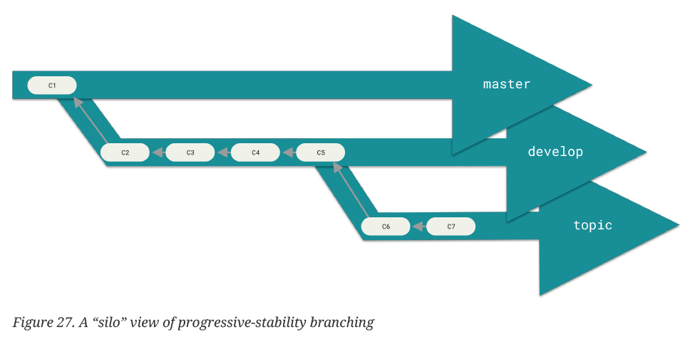
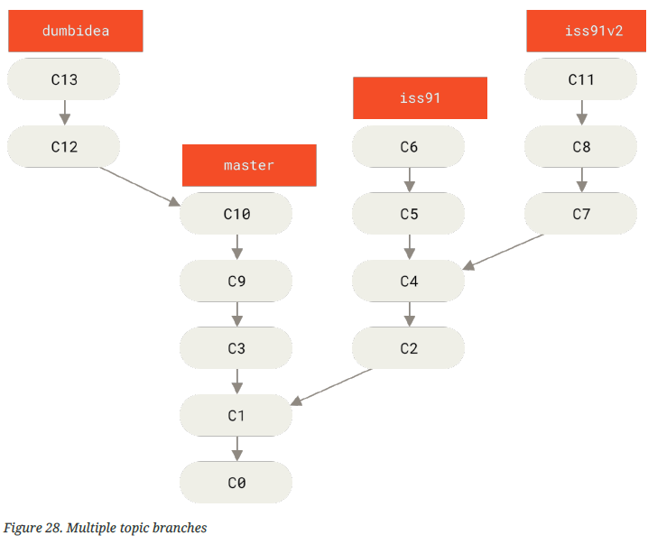
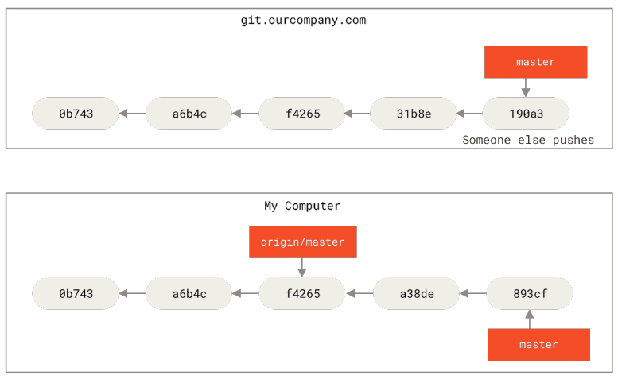
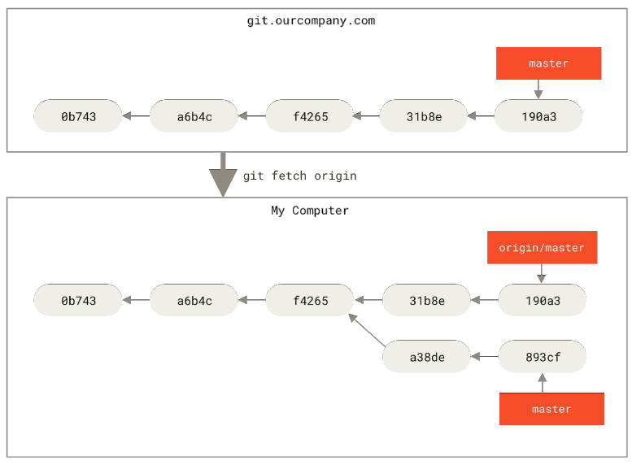

# Branches

Note on branches.

Jump to [here](#branch-commands) if you just want the commands.

TOC:

[Overview](#quick-overview)

[Creating a new branch](#creating-a-new-branch)

[Switching branches](#switching-branches)

[Basic branching and merging explained](#basic-branching-and-merging)

[Branch management](#branch-management)

[Changing branch names](#changing-a-branch-name)

[Git workflows](#git-workflows)

[Remote branches](#remote-branches)

[Pushing, tracking, pulling, deleting](#pushing)

---

## Quick overview

Git's killer branching model

Remember, git stores everything as a snapshot. Git stores a commit object that contains a pointer to the snapshot of the content. For example, if you commit three files:

- The versions of the files are stored. They are refered to as blobs.
- They are stored as a tree, with the commit point to the root of the tree

Add you add more commmits, the next commit will store a pointer to the commit that came before.

With multiple commits, the master/main branch should look like this 

With each commit looking like this 

How does git know what branch or commit you are currently on? It's a special pointer called `HEAD`. It should look like this on a single branch: 

---

## Creating a new branch

Creating a new branch initally only creates a new branch *pointer* for you to move around. This is done with `git branch <name>`.

Note that the header will still be pointed at the original branch. 

---

## Switching branches

To switch to an existing branch, use `git checkout <branchname>` or `git switch <branchname>`. This will switch the HEAD to the branch you specified.

If you make another commit on this branch, this will happen: 

So now the testing branch has moved forward, but the master/main branch still points to the older commit.

If you were to switch or checkout back to the master branch, *it will revert the files in your working directory back to the master snapshot*. This means any changes you make on this branch will diverge. This rewinds your work you've done in the testing branch so you can go in a different direction.

If you make some changes now and commit them, those changes wil be isolated from testing. You can switch back and forth and merge them when ready. 


---

## Basic branching and Merging

Assume we need to take the following course of action:

1. Do some work on the main branch
2. Create a new branch to work on a new feature
3. Do some work in that branch

But you receive a call to issue out a hotfix for a issue. You need to do the following

1. Go back to the main branch (which is left the way before you worked on the feature branch)
2. Create another branch to work on the hotfix
3. Merge the hotfix branch with the main branch
4. Go back to the feature branch and work on that.

It's important to note in part 2 step 3, the hotfix merge looks like this:


Because the merges are not divergent, git able to simply merge by fast forwarding, that is, moving the master branch pointer ahead.

Now you can delete your hotfix branch because master/main is already inline with it.

But as you work on the feature branch (shown as iss53 in the pictures), there will be a divergence. You check out into master/main again and merge. But this one won't be a fast forward, as the divergence means that you have to combine the commits of the common ancestor, the feature branch, and the hotfix into 1 snapshot.

Before:


After:


There will be merge conflicts sometimes. Think about it. If you change different parts of the file, it will just combine the differences. But if the branches change the same part of the file, it will conflict.

`git status` will let you know, and the file will contain a section like this:

```
<<<<<<< HEAD:index.html
<div id="footer">contact : email.support@github.com</div>
=======
<div id="footer">
please contact us at support@github.com
</div>
>>>>>>> iss53:index.html
```

The HEAD (on the master branch, which is what you merged into) is above the ======, and the iss53 branch is below it.

You can choose one or the other, or merge them yourself.

Afterwards, run `gitadd`, as staging the file marks it as resolve.

Then just `git commit` to conclude the merge.

More about merging in advanced merging.

---

## Branch Management

`git branch` with no arguments gets a listing of your current branches

`-v` shows the last single commit on each branch

`--merged` and `--no-merged` lists branches that have merged into your checked-out branch.

Add a `<branchname>` in order to apply the `--merge` command to that specific branch (instead of the checked out branch)

e.g

`git branch --no-merged testbranch`

The branches that `--merged` lists that don't have the * next to them are generally fine to delete.

`--no-merged`  will show branches not yet merched. 

To delete unmerged branches, you need to use `git branch -D <branchname>`.

---

## Changing a branch name

You can a branch name via:

`git branch --move <prebranchname> <postbranchname>`

Then push the correct branch to remote:

`git push --set-upstream origin <postbranchname>`

Then delete the bad branch from remote with:

`git push origin --delete <prebranchname>`

NOTE: changing the master/main branch of a work in progress repo will break intergrations and services. Change it on a newly started project or talk to your collaborators.

- Code that depend on the original maaster will need to update code and config.
- Adjust release scripts and builds.
- Update references in documentation
- Close or merge any pull requests that target the old branch.

Only then can you delete the old branch master.

---

## Git workflows

The long branching workflow:

- Contains a stable, master/main branch. 
- That master branch will have a parallel branch named develop, dev, or next, which is the one they work from or test stability. When this gets to a stable state, it will merge into master (or really, since master isn't being developed i.e it doesn't diverge), master will simply fast forward.
- This develop branch will pull into topic branches, which are much short lived and used for issues and other featuers.
- The idea is that these branches have multiple levels of stability, so when they reach a stable level, they'r merged into the branch above them.

This looks something like this.



Furthermore, you can include topic branches, and topic branches within topic branches. A topic branch is just a short lived branch that you create for a paraticular feature or issue.

1. Consider doing some work on master, branching off for an issue (iss91), then branching off again for a different way of handling that issue (iss91v2)
2. You go back to your master branch and then do a few commits, then branch off into an dumb idea branch.

It should look something like this:



But you realize that dumb idea was good. So what you can do here is a fast forward, which implements dumbidea, then a 3 point merge iwth iss91v2, which would discard some parts of the original iss91.

It should end up like this:


---

## Remote Branches

Remotes take on the name `<remote name> / <branch name>`

If you clone a repo, and say, you work on it, you update your local master pointer. The origin/master pointer will not move unless you contact the origin server. However, if someone else pushes work onto origin/master, that means your work will diverge. Before `git fetch` ing, it might look something like this.



and after you fetch:



Here's how it looks if you add another remote that's working on the same project, say, `teamone`, and see what they've done. You can see their references and where they're at. Right now, because it is just a subset of the origin remote, there is only really a reference/pointer update (meaning you'll just fetch their point, no new work is added), but if they branched off, you will fetch that too.


NOTE: Fetching does not give you local editable copies of what you fetch. If you fetch branch `serverfix` and you don't want to merge it with your own and instead work on a direct copy, you can use:

`git checkout -b serverfix origin/serverfix` which will create a new branch that starts with origin/serverfix is and tracks the specified remote branch. 

---

## Pushing

`git push <remote> <branch>` pushes the branch onto the remote specified

`git push <remote> <local branch>:<remote branch>` allows you to push a branch onto a different remote branch

---

## Tracking

- Local branch is called the tracking branch
- Remote branch that it tracks is the upstream branch
- `git pull` automatically pulls from the tracking branch

`git checkout -b <branchname> <remotename>/<remotebranch>` will create a new branch (with the name you specify) tracking specified remote branch

If you just want to set up a pair of same names:

`git checkout --track <remotename>/<branchname>` 

or even shorter:

`git checkout <branchname>` where the branch must NOT locally exist and match a remote branch name

`git branch -u <remote>/<branch>` will track your checked-out branch to specified remote/branch

`git branch -vv` shows what tracking branches you have set up (from last time you fetched!), last commit, and if its ahead or behind.

FETCH FROM ALL REMOTES to show most updated version of `git branch -vv`. You can do `git fetch --all`

### Pulling

Just a fetch followed by a merge.

Note, just explicity fetch and merge. 

---

## Deleting

`git push <remote> --delete <branch>` deletes the branch remotely

---

## Branch commands

`git branch` by itself shows all the current local branches, with a * next to your current branch

`-v` shows the last single commit on each branch

`-vv` shows what tracking branches you have set up (from last time you fetched!), last commit, and if its ahead or behind.

`--merged` and `--no-merged` lists branches that have merged into your checked-out branch.

`git branch <name>` creates a new branch pointer on the same commit you're working on.

`git branch -d <branchname>` deletes the merged branch

`git branch -D <branchname>` deletes unmerged branch

`git checkout <branchname>` will switch you to branchname's branch

`git checkout -b <branchname>` will create a new branch and switch to it simultaneously

---

Tracking

Note: `@{u} or @{upstream}` automatically refers to the upstream branch.

`git branch -u <remote>/<branch>` will track your checked-out branch to specified remote/branch

`git checkout -b <branchname> <remotename>/<remotebranch>` will create a new branch (with the name you specify) tracking specified remote branch

If you just want to set up a pair of same names:

`git checkout --track <remotename>/<branchname>` 

or even shorter:

`git checkout <branchname>` where the branch must NOT locally exist and match a remote branch name


---
Note: you can use switch now in git 2.23

`git switch <branchname>`

`git switch -c <branchname>` to create and switch to new branch.

`git switch -` return to last checked out branch

---

merging

`git checkout master` or the branch that you're merging into

`git merge <branch>` will merge that branch into your checked-out branch


---

info

`git status` or `git log --decorate` should let you know what branch you're on.

`git log --oneline --decorate --graph --all` is a handy command to print a history of your branches and commits

Note that `git log` only shows commit history of the branches BELOW the one you're checking out.

`git log <branchname>` shows the commit log for that branch.

`git log --all` will show the log of all branches.

---

remotes

`git ls-remote <remote>` or `git remote show <remote>` will show remote references (such as branches, tags, and so on)

`git fetch <remote>` fetches data and commits that you don't have, and updates your local data base, moving the origin/master pointer to its update position

`git push <remote> <branch>` pushs the branch commits to the remote specified

`git push <remote> --delete <branch>` deletes the branch remotely

